# Robustness Diagram SIMORA (Mermaid Format)

Dokumen ini berisi *Robustness Diagram* tunggal (konsolidasi) yang menggambarkan seluruh alur utama Sistem Informasi Monitoring Atlet Sepeda (SIMORA). 

Rancangan diagram ini memetakan interaksi antara 3 Aktor utama, elemen Antarmuka (**Boundary**), pengendali logika (**Controller**), dan entitas data (**Entity**) di dalam sistem.

---

## Robustness Diagram Konsolidasi SIMORA

```mermaid
flowchart TD
    %% Styling Definition
    classDef boundary fill:#e1f5fe,stroke:#03a9f4,stroke-width:2px;
    classDef controller fill:#e8f5e9,stroke:#4caf50,stroke-width:2px;
    classDef entity fill:#fff3e0,stroke:#ff9800,stroke-width:2px;

    %% Actors
    Atlet([Aktor: Atlet])
    Pelatih([Aktor: Pelatih])
    Manajemen([Aktor: Manajemen])

    %% Boundaries (UI/Screens)
    B_Reg("Boundary: Halaman Registrasi (Vue)")
    B_Login("Boundary: Halaman Login (Vue)")
    B_Dash("Boundary: Halaman Dashboard (Vue)")
    B_Fisik("Boundary: Halaman Metrik Fisik (Vue)")
    B_Log("Boundary: Form Input Log Latihan (Vue)")
    B_Detail("Boundary: Halaman Detail Atlet (Vue)")
    B_Sesi("Boundary: Form Sesi Latihan (Vue)")
    B_Eval("Boundary: Panel Evaluasi Latihan (Vue)")
    B_Pending("Boundary: Halaman Pending Users (Vue)")

    %% Controllers (Logic/Controllers/Services)
    C_Reg("Controller: Fortify::Register")
    C_Auth("Controller: Fortify::Login")
    C_Dash("Controller: LihatDashboardController")
    C_Fisik("Controller: KelolaDataMetrikFisikController")
    C_Log("Controller: AnalisaGrafikDanStatistikLatihanController")
    C_Verify("Controller: MemverifikasiPendaftaranController")
    C_Detail("Controller: LihatRingkasanDaftarAtletController")
    C_Sesi("Controller: KelolaJadwalSesiLatihanController")
    C_Eval("Controller: KelolaEvaluasiLatihanController")

    %% Entities (Models/Database Tables)
    E_User[("Entity: User (Model)")]
    E_Profil[("Entity: ProfilAtlet (Model)")]
    E_Fisik[("Entity: DataFisik (Model)")]
    E_Log[("Entity: LogLatihan (Model)")]
    E_Sesi[("Entity: SesiLatihan (Model)")]

    %% -------------------------------------------------------------
    %% Connections & Flow
    %% -------------------------------------------------------------

    %% 1. Autentikasi, Registrasi & Verifikasi
    Atlet --> B_Reg
    B_Reg --> C_Reg
    C_Reg --> E_User
    C_Reg --> E_Profil

    Atlet --> B_Login
    Pelatih --> B_Login
    Manajemen --> B_Login

    B_Login --> C_Auth
    C_Auth --> E_User
    C_Auth --> B_Dash

    Manajemen --> B_Pending
    B_Pending --> C_Verify
    C_Verify --> E_User
    C_Verify --> B_Pending

    %% 2. Pengelolaan Latihan & Metrik Fisik (Atlet)
    Atlet --> B_Log
    B_Log --> C_Log
    C_Log --> E_Log
    C_Log --> B_Dash

    Atlet --> B_Fisik
    B_Fisik --> C_Fisik
    C_Fisik --> E_Fisik
    C_Fisik --> B_Dash

    %% 3. Monitoring & Kepelatihan (Pelatih)
    Pelatih --> B_Detail
    B_Detail --> C_Detail
    C_Detail --> E_User
    C_Detail --> E_Fisik
    C_Detail --> E_Log
    C_Detail --> B_Detail

    Pelatih --> B_Sesi
    B_Sesi --> C_Sesi
    C_Sesi --> E_Sesi
    C_Sesi --> E_User
    C_Sesi --> B_Sesi

    Pelatih --> B_Eval
    B_Eval --> C_Eval
    C_Eval --> E_Log
    C_Eval --> B_Eval

    %% Apply Classes
    class B_Reg,B_Login,B_Dash,B_Fisik,B_Log,B_Detail,B_Sesi,B_Eval,B_Pending boundary;
    class C_Reg,C_Auth,C_Dash,C_Fisik,C_Log,C_Verify,C_Detail,C_Sesi,C_Eval controller;
    class E_User,E_Profil,E_Fisik,E_Log,E_Sesi entity;
```

