# Sequence Diagram SIMORA (Mermaid Format)

Dokumen ini berisi seluruh *Sequence Diagram* untuk Sistem Informasi Monitoring Atlet Sepeda (SIMORA) berdasarkan 15 Use Case Utama beserta turunan dan skenarionya. Diagram ditulis menggunakan sintaks **Mermaid** agar dapat langsung dirender di editor Markdown atau di [Mermaid Live Editor](https://mermaid.live).

---

## UC-01 Autentikasi Pengguna

### UC-01.1 Login
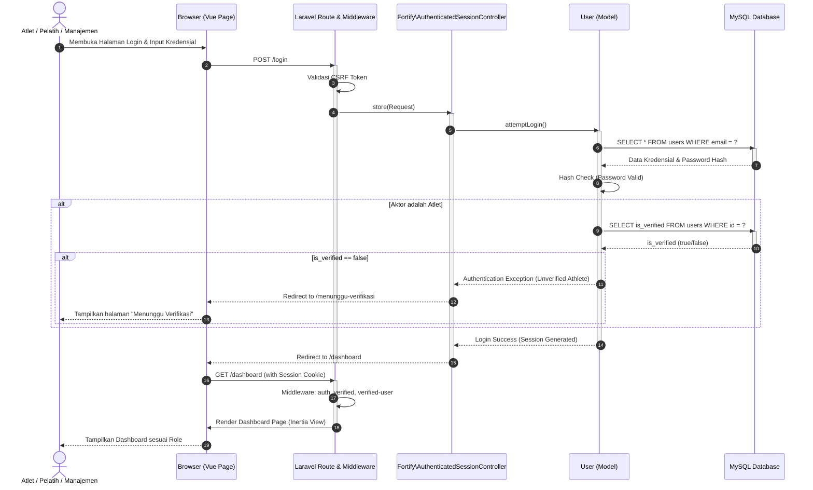

### UC-01.2 Register
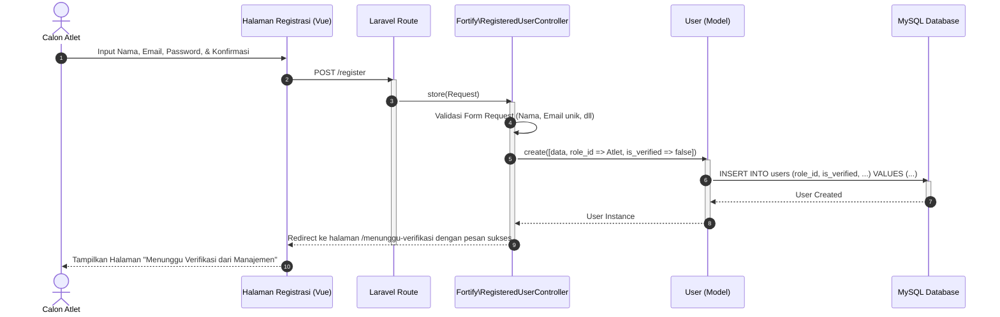

### UC-01.3 Lupa Password
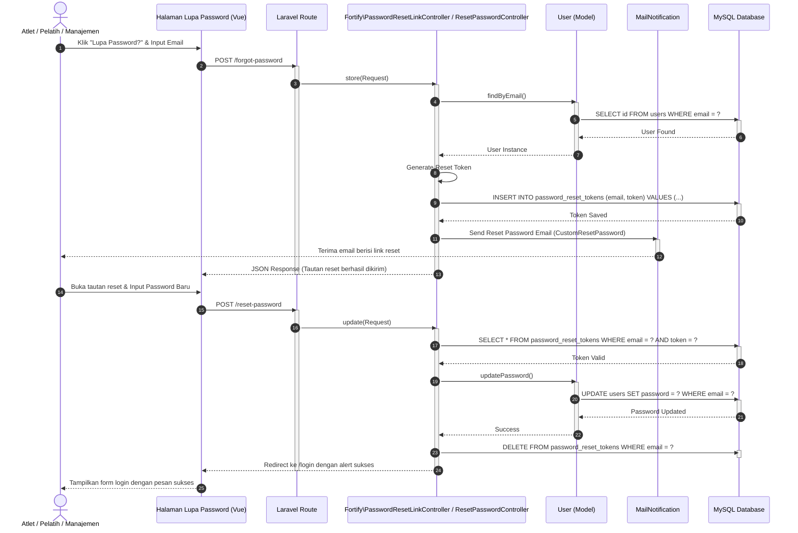

---

## UC-02 Lihat Dashboard

### UC-02.1 Lihat Dashboard Atlet
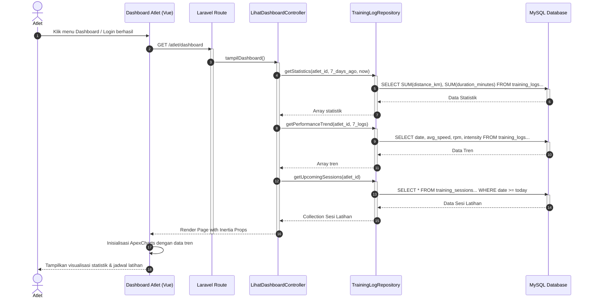

### UC-02.2 Update Cepat (atlet)
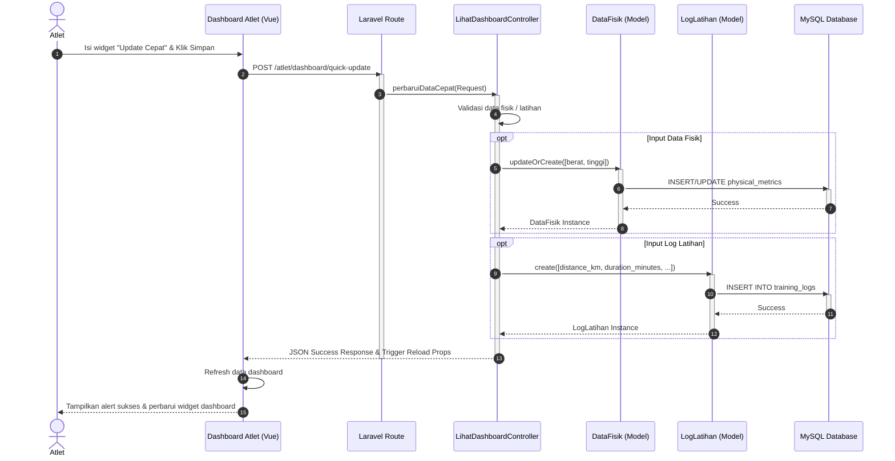

### UC-02.3 Lihat Dashboard Pelatih
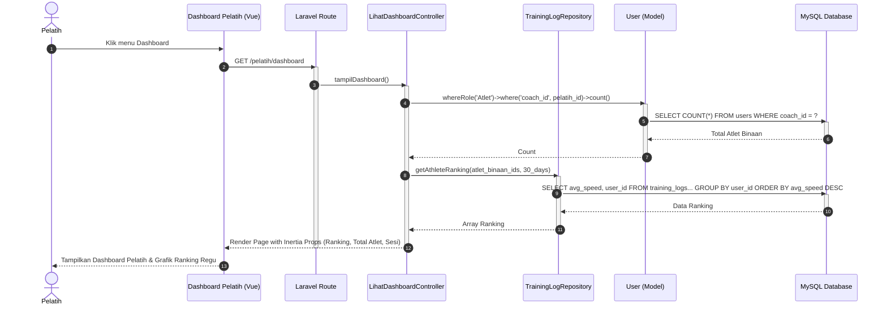

### UC-02.4 Lihat Dashboard Manajemen
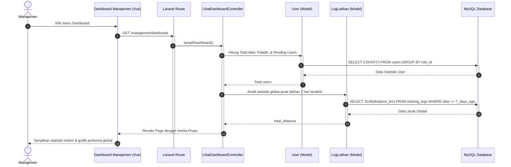

---

## UC-03 Kelola Profil Pengguna

### UC-03.1 Lihat Profil Pengguna
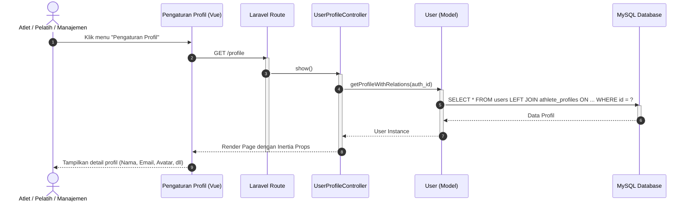

### UC-03.2 Ubah Profil Pengguna
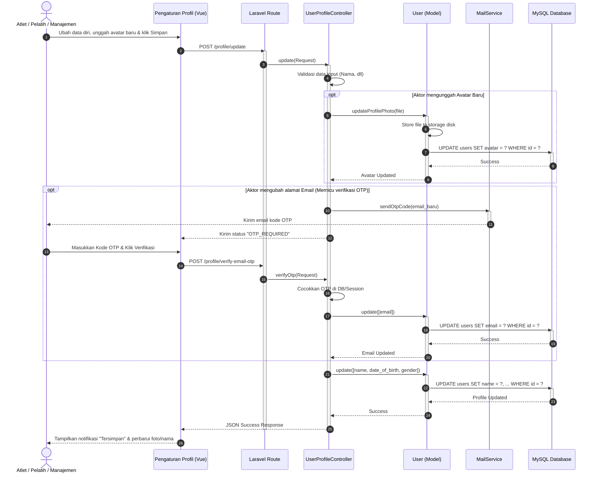

### UC-03.3 Hapus Akun Pengguna
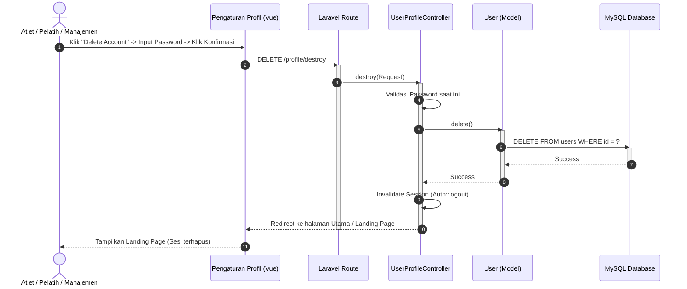

---

## UC-04 Memverifikasi Pendaftaran & Menetapkan Pelatih

### UC-04.1 Lihat daftar Atlet Belum Terverifikasi
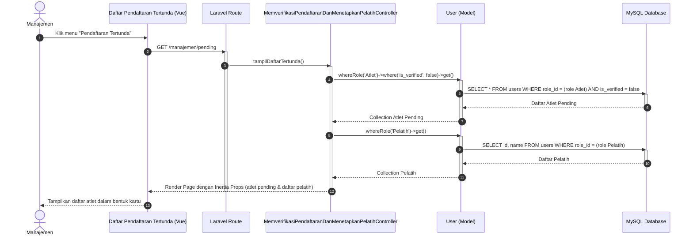

### UC-04.2 Ubah Status Terverifikasi dan Menentukan Pelatih
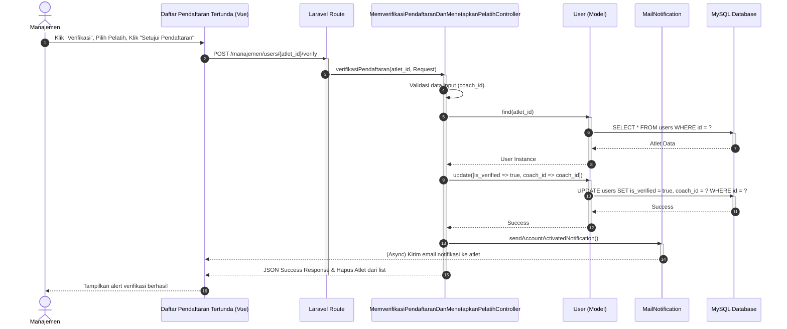

---

## UC-05 Lihat Ringkasan Daftar Atlet

### UC-05.1 Lihat Daftar Atlet
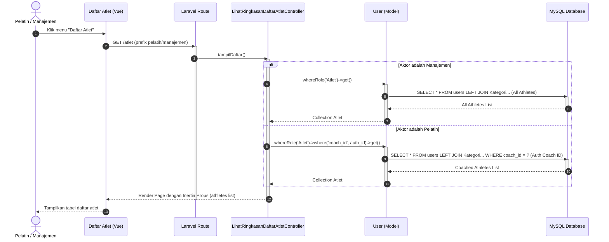

### UC-05.2 Lihat Detail Atlet
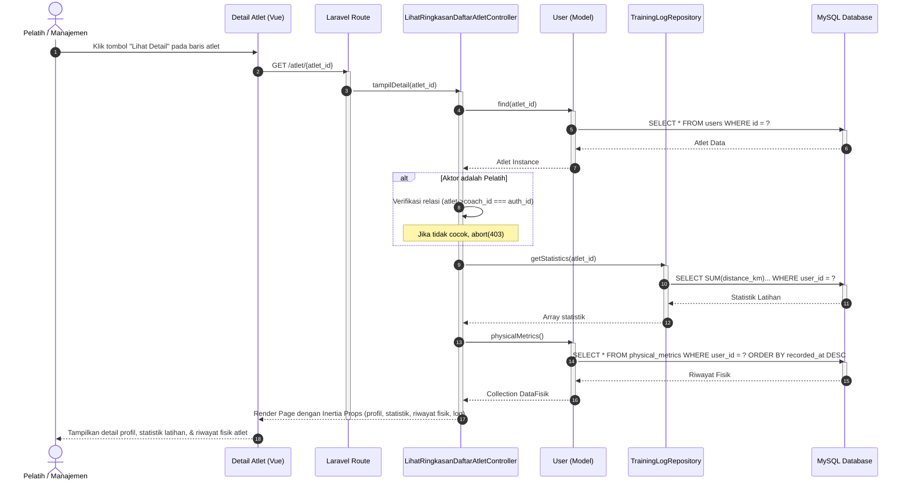

### UC-05.3 Perbarui Pelatih Pembina
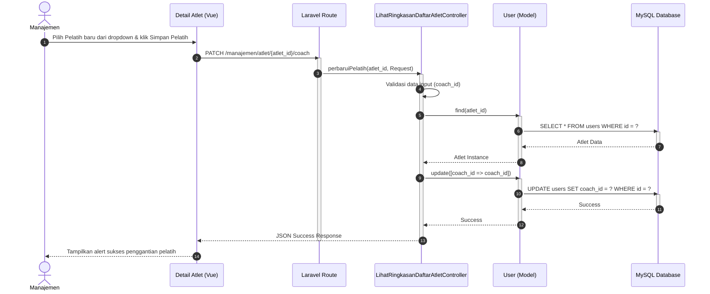

### UC-05.4 Perbarui Kategori Atlet
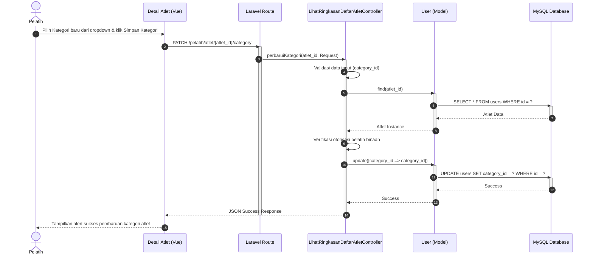

---

## UC-06 Kelola Data Metrik Fisik (BMI)

### UC-06.1 Update BMI Atlet
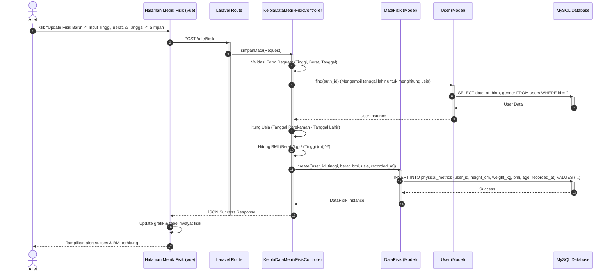

### UC-06.2 Lihat Statistik BMI Atlet
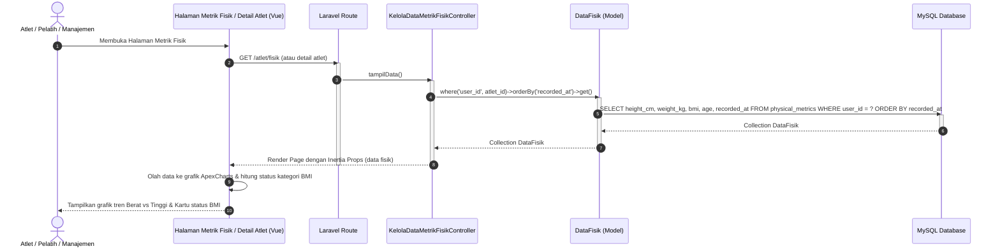

### UC-06.3 Update Tanggal Lahir Atlet
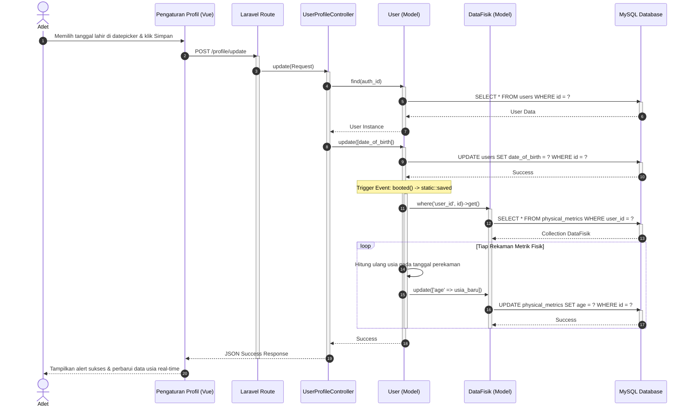

### UC-06.4 Lihat Tanggal Lahir Atlet
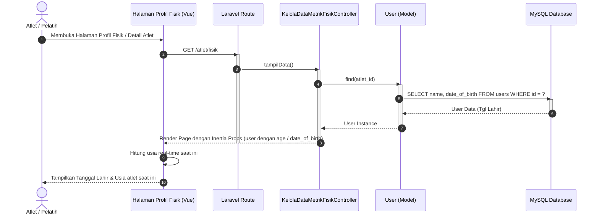

---

## UC-07 Kelola Jadwal Sesi Latihan

### UC-07.1 Buat Sesi Latihan
```mermaid
sequenceDiagram
    autonumber
    actor Pelatih as Pelatih
    participant Browser as Halaman Sesi Latihan (Vue)
    participant Route as Laravel Route
    participant Controller as KelolaJadwalSesiLatihanController
    participant ModelSession as SesiLatihan (Model)
    participant DB as MySQL Database

    Pelatih->>Browser: Klik "Tambah Sesi Latihan" -> Input Detail & Target -> Pilih Atlet -> Simpan
    Browser->>Route: POST /pelatih/sesi-latihan
    activate Route
    Route->>Controller: simpan(Request)
    activate Controller
    Controller->>Controller: Validasi Form Request (Judul, Tanggal, Target, dll)
    Controller->>ModelSession: create([judul, tanggal, exercise_type_id, ...])
    activate ModelSession
    ModelSession->>DB: INSERT INTO training_sessions (title, date, target_distance, ...) VALUES (...)
    activate DB
    DB-->>ModelSession: Session Created (ID Sesi)
    deactivate DB
    ModelSession-->>Controller: SesiLatihan Instance
    deactivate ModelSession

    Controller->>ModelSession: athletes()->sync(daftar_atlet_ids)
    activate ModelSession
    ModelSession->>DB: INSERT INTO training_session_user (training_session_id, user_id) VALUES (...)
    activate DB
    DB-->>ModelSession: Synchronized
    deactivate DB
    ModelSession-->>Controller: Sync Success
    deactivate ModelSession

    Controller-->>Browser: JSON Success Response
    deactivate Controller
    deactivate Route
    Browser->>Browser: Refresh kalender / daftar sesi latihan
    Browser-->>Pelatih: Tampilkan alert sukses & perbarui jadwal
```

### UC-07.2 Lihat Sesi Latihan
```mermaid
sequenceDiagram
    autonumber
    actor Aktor as Pelatih / Atlet
    participant Browser as Jadwal Sesi Latihan (Vue)
    participant Route as Laravel Route
    participant Controller as KelolaJadwalSesiLatihanController
    participant Repo as TrainingLogRepository
    participant DB as MySQL Database

    Aktor->>Browser: Klik menu "Jadwal Latihan" / "Latihan Saya"
    Browser->>Route: GET /pelatih/sesi-latihan (atau /atlet/latihan)
    activate Route
    Route->>Controller: tampilDaftar()
    activate Controller

    alt Aktor adalah Pelatih
        Controller->>Repo: getCoachedSessions(pelatih_id)
        activate Repo
        Repo->>DB: SELECT * FROM training_sessions WHERE coach_id = ?
        activate DB
        DB-->>Repo: Sesi Latihan Pelatih
        deactivate DB
        Repo-->>Controller: Collection Sesi Latihan
        deactivate Repo
    else Aktor adalah Atlet
        Controller->>Repo: getUpcomingSessions(atlet_id)
        activate Repo
        Repo->>DB: SELECT * FROM training_sessions INNER JOIN training_session_user WHERE user_id = ?
        activate DB
        DB-->>Repo: Sesi Latihan Atlet
        deactivate DB
        Repo-->>Controller: Collection Sesi Latihan
        deactivate Repo
    end

    Controller-->>Browser: Render Page dengan Inertia Props (daftar sesi)
    deactivate Controller
    deactivate Route
    Browser-->>Aktor: Tampilkan kalender atau tabel sesi latihan
```

### UC-07.3 Hapus Sesi Latihan
```mermaid
sequenceDiagram
    autonumber
    actor Pelatih as Pelatih
    participant Browser as Jadwal Sesi Latihan (Vue)
    participant Route as Laravel Route
    participant Controller as KelolaJadwalSesiLatihanController
    participant ModelSession as SesiLatihan (Model)
    participant DB as MySQL Database

    Pelatih->>Browser: Klik "Hapus" pada sesi latihan -> Klik Konfirmasi Hapus
    Browser->>Route: DELETE /pelatih/sesi-latihan/{id}
    activate Route
    Route->>Controller: hapus(id)
    activate Controller
    Controller->>ModelSession: find(id)
    activate ModelSession
    ModelSession->>DB: SELECT * FROM training_sessions WHERE id = ?
    activate DB
    DB-->>ModelSession: Session Data
    deactivate DB
    ModelSession-->>Controller: SesiLatihan Instance
    deactivate ModelSession

    Controller->>Controller: Validasi Hak Kepemilikan (session->coach_id === auth_id)
    Controller->>ModelSession: delete()
    activate ModelSession
    ModelSession->>DB: DELETE FROM training_sessions WHERE id = ? (Cascade/Delete User Pivot)
    activate DB
    DB-->>ModelSession: Success
    deactivate DB
    ModelSession-->>Controller: Success
    deactivate ModelSession

    Controller-->>Browser: JSON Success Response
    deactivate Controller
    deactivate Route
    Browser->>Browser: Hapus item dari tampilan/kalender
    Browser-->>Pelatih: Tampilkan alert sukses "Sesi latihan dihapus"
```

---

## UC-08 Analisa Grafik & Statistik Latihan

### UC-08.1 Lihat Grafik & Statistik Atlet
```mermaid
sequenceDiagram
    autonumber
    actor Aktor as Atlet / Pelatih / Manajemen
    participant Browser as Analisa Latihan (Vue)
    participant Route as Laravel Route
    participant Controller as AnalisaGrafikDanStatistikLatihanController
    participant Repo as TrainingLogRepository
    participant DB as MySQL Database

    Aktor->>Browser: Buka menu "Analisa Latihan" / "Detail Latihan"
    Browser->>Route: GET /atlet/latihan (atau detail atlet bimbingan)
    activate Route
    Route->>Controller: tampilData()
    activate Controller
    Controller->>Repo: getPerformanceTrend(atlet_id, start_date, end_date)
    activate Repo
    Repo->>DB: SELECT date, distance_km, duration_minutes, avg_speed, rpm, intensity FROM training_logs WHERE athlete_id = ?
    activate DB
    DB-->>Repo: Log Latihan
    deactivate DB
    Repo-->>Controller: Array log tren
    deactivate Repo

    Controller-->>Browser: Render Page dengan Inertia Props (log tren)
    deactivate Controller
    deactivate Route
    Browser->>Browser: Format data untuk sumbu X (Tanggal) & sumbu Y (Metrik)
    Browser->>Browser: Inisialisasi ApexCharts (Speed Line, HR Line, RPM Line)
    Browser-->>Aktor: Tampilkan grafik performa interaktif beserta ringkasan statistik
```

---

## UC-09 Bandingkan Performa & Memfilter Riwayat

### UC-09.1 Lihat Daftar Performa Atlet
```mermaid
sequenceDiagram
    autonumber
    actor Aktor as Pelatih / Manajemen
    participant Browser as Komparasi Performa (Vue)
    participant Route as Laravel Route
    participant Controller as BandingkanPerformaDanMemfilterRiwayatController
    participant User as User (Model)
    participant DB as MySQL Database

    Aktor->>Browser: Klik menu "Komparasi Performa"
    Browser->>Route: GET /komparasi-performa
    activate Route
    Route->>Controller: tampilHalaman()
    activate Controller

    alt Aktor adalah Manajemen
        Controller->>User: whereRole('Atlet')->get()
        activate User
        User->>DB: SELECT id, name, avatar FROM users WHERE role_id = (Atlet)
        activate DB
        DB-->>User: Semua Atlet
        deactivate DB
        User-->>Controller: Collection Atlet
        deactivate User
    else Aktor adalah Pelatih
        Controller->>User: whereRole('Atlet')->where('coach_id', pelatih_id)->get()
        activate User
        User->>DB: SELECT id, name, avatar FROM users WHERE role_id = (Atlet) AND coach_id = ?
        activate DB
        DB-->>User: Atlet Binaan
        deactivate DB
        User-->>Controller: Collection Atlet
        deactivate User
    end

    Controller-->>Browser: Render Page dengan Inertia Props (daftar atlet)
    deactivate Controller
    deactivate Route
    Browser-->>Aktor: Tampilkan pilihan atlet dalam bentuk chips
```

### UC-09.2 Bandingkan Performa Atlet
```mermaid
sequenceDiagram
    autonumber
    actor Aktor as Pelatih / Manajemen
    participant Browser as Komparasi Performa (Vue)
    participant Route as Laravel Route
    participant Controller as BandingkanPerformaDanMemfilterRiwayatController
    participant Repo as TrainingLogRepository
    participant DB as MySQL Database

    Aktor->>Browser: Pilih minimal 2 atlet -> Tentukan rentang tanggal -> Klik "Bandingkan"
    Browser->>Route: GET /komparasi-performa/data (with query params: athlete_ids, start_date, end_date)
    activate Route
    Route->>Controller: ambilDataKomparasi(Request)
    activate Controller
    Controller->>Controller: Validasi array athlete_ids & rentang tanggal
    
    alt Aktor adalah Pelatih
        Controller->>Controller: Pastikan semua athlete_ids adalah binaan pelatih tersebut
    end

    Controller->>Repo: getComparisonData(athlete_ids, start_date, end_date)
    activate Repo
    Repo->>DB: SELECT athlete_id, SUM(distance_km), AVG(avg_speed), AVG(rpm) FROM training_logs WHERE athlete_id IN (...) GROUP BY athlete_id
    activate DB
    DB-->>Repo: Rata-rata & Total Performa
    deactivate DB
    Repo-->>Controller: Array komparasi
    deactivate Repo

    loop Tiap Athlete ID
        Controller->>Repo: getPerformanceTrend(athlete_id, start_date, end_date)
        activate Repo
        Repo->>DB: SELECT date, avg_speed FROM training_logs WHERE athlete_id = ?
        activate DB
        DB-->>Repo: Data tren individual
        deactivate DB
        Repo-->>Controller: Array tren
        deactivate Repo
    end

    Controller-->>Browser: JSON Response (data komparasi & tren)
    deactivate Controller
    deactivate Route
    Browser->>Browser: Inisialisasi Grafik Batang (Bar Chart) & Grafik Garis Komparatif
    Browser-->>Aktor: Tampilkan kartu komparasi detail & perbandingan visual
```

---

## UC-10 Lihat Laporan Riwayat Performa

### UC-10.1 Lihat Ringkasan Performa Atlet
```mermaid
sequenceDiagram
    autonumber
    actor Aktor as Pelatih / Manajemen
    participant Browser as Laporan Performa (Vue)
    participant Route as Laravel Route
    participant Controller as LihatLaporanRiwayatPerformaController
    participant User as User (Model)
    participant DB as MySQL Database

    Aktor->>Browser: Klik menu "Laporan Performa"
    Browser->>Route: GET /laporan
    activate Route
    Route->>Controller: tampilData()
    activate Controller
    
    alt Aktor adalah Manajemen
        Controller->>User: whereRole('Atlet')->with('latestPhysicalMetric')->get()
        activate User
        User->>DB: SELECT * FROM users LEFT JOIN physical_metrics... (All Athletes)
        activate DB
        DB-->>User: Daftar Atlet & Metrik
        deactivate DB
        User-->>Controller: Collection Atlet
        deactivate User
    else Aktor adalah Pelatih
        Controller->>User: whereRole('Atlet')->where('coach_id', pelatih_id)->with('latestPhysicalMetric')->get()
        activate User
        User->>DB: SELECT * FROM users LEFT JOIN physical_metrics... WHERE coach_id = ?
        activate DB
        DB-->>User: Atlet Binaan & Metrik
        deactivate DB
        User-->>Controller: Collection Atlet
        deactivate User
    end

    Controller-->>Browser: Render Page dengan Inertia Props (data ringkasan atlet)
    deactivate Controller
    deactivate Route
    Browser-->>Aktor: Tampilkan tabel rekapitulasi performa (Jarak total, Durasi, BMI)
```

### UC-10.2 Export CSV Semua Performa Atlet
```mermaid
sequenceDiagram
    autonumber
    actor Aktor as Pelatih / Manajemen
    participant Browser as Laporan Performa (Vue)
    participant Route as Laravel Route
    participant Controller as LihatLaporanRiwayatPerformaController
    participant Log as LogLatihan (Model)
    participant DB as MySQL Database

    Aktor->>Browser: Tentukan rentang tanggal -> Klik "Export CSV Semua Atlet"
    Browser->>Route: POST /laporan/export (body: start_date, end_date)
    activate Route
    Route->>Controller: eksporData(Request)
    activate Controller
    Controller->>Controller: Validasi rentang tanggal
    
    alt Aktor adalah Manajemen
        Controller->>Log: forPeriod(start, end)->with('athlete')->get()
        activate Log
        Log->>DB: SELECT * FROM training_logs INNER JOIN users... WHERE date BETWEEN ? AND ?
        activate DB
        DB-->>Log: Data Log Semua Atlet
        deactivate DB
        Log-->>Controller: Collection Log
        deactivate Log
    else Aktor adalah Pelatih
        Controller->>Log: whereHas('athlete', coach_id)->forPeriod(start, end)->get()
        activate Log
        Log->>DB: SELECT * FROM training_logs INNER JOIN users... WHERE coach_id = ? AND date BETWEEN ? AND ?
        activate DB
        DB-->>Log: Data Log Atlet Binaan
        deactivate DB
        Log-->>Controller: Collection Log
        deactivate Log
    end

    Controller->>Controller: Format data menjadi string CSV (Tanggal, Nama, Jarak, Durasi, dll)
    Controller-->>Browser: Download CSV Stream ("Laporan_Seluruh_Atlet.csv")
    deactivate Controller
    deactivate Route
    Browser-->>Aktor: Mengunduh berkas laporan CSV ke komputer
```

### UC-10.3 Export CSV Salah Satu Performa Atlet
```mermaid
sequenceDiagram
    autonumber
    actor Aktor as Pelatih / Manajemen
    participant Browser as Laporan Performa (Vue)
    participant Route as Laravel Route
    participant Controller as LihatLaporanRiwayatPerformaController
    participant Log as LogLatihan (Model)
    participant DB as MySQL Database

    Aktor->>Browser: Pilih Atlet -> Tentukan tanggal -> Klik "Export CSV" pada baris atlet
    Browser->>Route: POST /laporan/export (body: athlete_id, start_date, end_date)
    activate Route
    Route->>Controller: eksporData(Request)
    activate Controller
    Controller->>Controller: Validasi data input (athlete_id wajib)
    
    alt Aktor adalah Pelatih
        Controller->>Controller: Pastikan athlete_id adalah binaan pelatih (Auth check)
    end

    Controller->>Log: forAthlete(athlete_id)->forPeriod(start, end)->get()
    activate Log
    Log->>DB: SELECT * FROM training_logs WHERE athlete_id = ? AND date BETWEEN ? AND ?
    activate DB
    DB-->>Log: Data Log Atlet
    deactivate DB
    Log-->>Controller: Collection Log
    deactivate Log

    Controller->>Controller: Format data log atlet menjadi CSV
    Controller-->>Browser: Download CSV Stream ("Laporan_[Nama_Atlet].csv")
    deactivate Controller
    deactivate Route
    Browser-->>Aktor: Mengunduh berkas laporan CSV atlet tersebut
```

---

## UC-11 Kelola Evaluasi & Umpan Balik Latihan

### UC-11.1 Lihat Evaluasi & Umpan Balik Latihan
```mermaid
sequenceDiagram
    autonumber
    actor Aktor as Atlet / Pelatih
    participant Browser as Detail Log Latihan (Vue)
    participant Route as Laravel Route
    participant Controller as KelolaEvaluasiDanUmpanBalikLatihanController
    participant Log as LogLatihan (Model)
    participant DB as MySQL Database

    Aktor->>Browser: Klik rincian riwayat latihan
    Browser->>Route: GET /atlet/riwayat-latihan/{log_id} (atau via detail atlet)
    activate Route
    Route->>Controller: lihatDetailLog(log_id)
    activate Controller
    Controller->>Log: find(log_id)
    activate Log
    Log->>DB: SELECT coach_rating, coach_evaluation, coach_comments FROM training_logs WHERE id = ?
    activate DB
    DB-->>Log: Data Evaluasi Pelatih
    deactivate DB
    Log-->>Controller: LogLatihan Instance
    deactivate Log
    Controller-->>Browser: Render Page dengan Inertia Props (evaluasi data)
    deactivate Controller
    deactivate Route
    Browser->>Browser: Ubah angka rating (1-10) menjadi visualisasi bintang
    Browser-->>Aktor: Tampilkan ulasan evaluasi & rating bintang dari pelatih
```

### UC-11.2 Update Evaluasi & Umpan Balik Latihan
```mermaid
sequenceDiagram
    autonumber
    actor Pelatih as Pelatih
    participant Browser as Detail Log Atlet (Vue)
    participant Route as Laravel Route
    participant Controller as KelolaEvaluasiDanUmpanBalikLatihanController
    participant Log as LogLatihan (Model)
    participant DB as MySQL Database

    Pelatih->>Browser: Klik "Evaluasi" -> Isi Ulasan, Rating (1-10), Kehadiran -> Klik Simpan Evaluasi
    Browser->>Route: PATCH /pelatih/riwayat-latihan/{log_id}/evaluation
    activate Route
    Route->>Controller: perbaruiEvaluasi(log_id, Request)
    activate Controller
    Controller->>Controller: Validasi data input (coach_rating, coach_evaluation, status_kehadiran)
    Controller->>Log: find(log_id)
    activate Log
    Log->>DB: SELECT * FROM training_logs WHERE id = ?
    activate DB
    DB-->>Log: Log Data
    deactivate DB
    Log-->>Controller: LogLatihan Instance
    deactivate Log

    Controller->>Controller: Verifikasi hak akses pelatih binaan
    Controller->>Log: update([coach_rating, coach_evaluation, coach_comments, status_kehadiran])
    activate Log
    Log->>DB: UPDATE training_logs SET coach_rating = ?, coach_evaluation = ?, status_kehadiran = ? WHERE id = ?
    activate DB
    DB-->>Log: Success
    deactivate DB
    Log-->>Controller: Success
    deactivate Log

    Controller-->>Browser: JSON Success Response
    deactivate Controller
    deactivate Route
    Browser->>Browser: Update status log di tampilan (misal: "Sudah Dievaluasi")
    Browser-->>Pelatih: Tampilkan alert sukses "Evaluasi berhasil disimpan"
```

---

## UC-12 Kelola Pesan

### UC-12.1 Kirim Pesan
```mermaid
sequenceDiagram
    autonumber
    actor Aktor as Pelatih / Manajemen
    participant Browser as Halaman Pesan (Vue)
    participant Route as Laravel Route
    participant Controller as KelolaPesanController
    participant Message as Pesan (Model)
    participant DB as MySQL Database

    Aktor->>Browser: Buka Form Catatan/Pesan -> Pilih Atlet -> Input Pesan -> Klik Kirim
    Browser->>Route: POST /pesan (prefix pelatih/manajemen)
    activate Route
    Route->>Controller: simpanPesan(Request)
    activate Controller
    Controller->>Controller: Validasi Form Request (receiver_id, message_text)
    Controller->>Message: create([sender_id => auth_id, receiver_id => atlet_id, content => message_text, is_read => false])
    activate Message
    Message->>DB: INSERT INTO messages (sender_id, receiver_id, content, is_read) VALUES (...)
    activate DB
    DB-->>Message: Message Saved
    deactivate DB
    Message-->>Controller: Message Instance
    deactivate Message

    Controller-->>Browser: JSON Success Response (Message sent)
    deactivate Controller
    deactivate Route
    Browser->>Browser: Tambahkan pesan ke log percakapan
    Browser-->>Aktor: Tampilkan status terkirim & alert sukses
```

### UC-12.2 Lihat Pesan
```mermaid
sequenceDiagram
    autonumber
    actor Atlet as Atlet
    participant Browser as Dashboard/Pesan Atlet (Vue)
    participant Route as Laravel Route
    participant Controller as KelolaPesanController
    participant Message as Pesan (Model)
    participant DB as MySQL Database

    Atlet->>Browser: Masuk Dashboard / Klik panel Pesan Pelatih
    Browser->>Route: GET /atlet/dashboard (atau load pesan)
    activate Route
    Route->>Controller: ambilPesan() (atau bagian dari dashboard load)
    activate Controller
    Controller->>Message: where('receiver_id', atlet_id)->orderBy('created_at', 'desc')->get()
    activate Message
    Message->>DB: SELECT * FROM messages WHERE receiver_id = ? ORDER BY created_at DESC
    activate DB
    DB-->>Message: Daftar Pesan
    deactivate DB
    Message-->>Controller: Collection Pesan
    deactivate Message
    Controller-->>Browser: Render Page/JSON (Pesan dengan status is_read)
    deactivate Controller
    deactivate Route

    Browser-->>Atlet: Tampilkan list pesan dengan badge "Belum Dibaca"
    
    Atlet->>Browser: Klik tombol "Tandai Dibaca" pada salah satu pesan
    Browser->>Route: PATCH /atlet/pesan/{pesan_id}/read
    activate Route
    Route->>Controller: tandaiSudahDibaca(pesan_id)
    activate Controller
    Controller->>Message: find(pesan_id)
    activate Message
    Message->>DB: SELECT * FROM messages WHERE id = ?
    activate DB
    DB-->>Message: Message Data
    deactivate DB
    Message-->>Controller: Message Instance
    deactivate Message

    Controller->>Message: update([is_read => true])
    activate Message
    Message->>DB: UPDATE messages SET is_read = true WHERE id = ?
    activate DB
    DB-->>Message: Success
    deactivate DB
    Message-->>Controller: Success
    deactivate Message

    Controller-->>Browser: JSON Success Response
    deactivate Controller
    deactivate Route
    Browser->>Browser: Ubah tampilan pesan menjadi redup / hilangkan badge unread
    Browser-->>Atlet: Status pesan diperbarui
```

### UC-12.3 Hapus Pesan
```mermaid
sequenceDiagram
    autonumber
    actor Pelatih as Pelatih
    participant Browser as Halaman Pesan (Vue)
    participant Route as Laravel Route
    participant Controller as KelolaPesanController
    participant Message as Pesan (Model)
    participant DB as MySQL Database

    Pelatih->>Browser: Klik tombol "Hapus" (X) pada pesan yang pernah dikirim
    Browser->>Route: DELETE /pesan/{pesan_id} (prefix pelatih/manajemen)
    activate Route
    Route->>Controller: hapusPesan(pesan_id)
    activate Controller
    Controller->>Message: find(pesan_id)
    activate Message
    Message->>DB: SELECT * FROM messages WHERE id = ?
    activate DB
    DB-->>Message: Message Data
    deactivate DB
    Message-->>Controller: Message Instance
    deactivate Message

    Controller->>Controller: Verifikasi hak kepemilikan pesan (sender_id === auth_id)
    Controller->>Message: delete()
    activate Message
    Message->>DB: DELETE FROM messages WHERE id = ?
    activate DB
    DB-->>Message: Success
    deactivate DB
    Message-->>Controller: Success
    deactivate Message

    Controller-->>Browser: JSON Success Response
    deactivate Controller
    deactivate Route
    Browser->>Browser: Hapus baris pesan dari riwayat
    Browser-->>Pelatih: Tampilkan alert sukses penarikan pesan
```

---

## UC-13 Kelola Event & Partisipasi

### UC-13.1 Buat Event & Menetapkan Partisipasi
```mermaid
sequenceDiagram
    autonumber
    actor Aktor as Pelatih / Manajemen
    participant Browser as Kelola Acara (Vue)
    participant Route as Laravel Route
    participant Controller as KelolaEventDanPartisipasiController
    participant ModelEvent as Event (Model)
    participant DB as MySQL Database

    Aktor->>Browser: Klik "Tambah Event Baru" -> Input Detail Perlombaan & Pilih Atlet -> Simpan
    Browser->>Route: POST /acara (prefix pelatih/manajemen)
    activate Route
    Route->>Controller: simpanData(Request)
    activate Controller
    Controller->>Controller: Validasi Form Request (Nama Event, Tanggal, Lokasi, Kategori)
    Controller->>ModelEvent: create([nama, tanggal, lokasi, jenis_event_id, ...])
    activate ModelEvent
    ModelEvent->>DB: INSERT INTO events (name, date, location, ...) VALUES (...)
    activate DB
    DB-->>ModelEvent: Event Created (ID Event)
    deactivate DB
    ModelEvent-->>Controller: Event Instance
    deactivate ModelEvent

    Controller->>ModelEvent: athletes()->sync(daftar_atlet_ids)
    activate ModelEvent
    ModelEvent->>DB: INSERT INTO event_user (event_id, user_id, status => "Berencana") VALUES (...)
    activate DB
    DB-->>ModelEvent: Synchronized
    deactivate DB
    ModelEvent-->>Controller: Sync Success
    deactivate ModelEvent

    Controller-->>Browser: JSON Success Response
    deactivate Controller
    deactivate Route
    Browser->>Browser: Tambahkan event ke kalender / daftar acara
    Browser-->>Aktor: Tampilkan alert sukses pembuatan event
```

### UC-13.2 Lihat Event & Menetapkan Partisipasi
```mermaid
sequenceDiagram
    autonumber
    actor Aktor as Pelatih / Atlet / Manajemen
    participant Browser as Halaman Event/Acara (Vue)
    participant Route as Laravel Route
    participant Controller as KelolaEventDanPartisipasiController
    participant ModelEvent as Event (Model)
    participant DB as MySQL Database

    Aktor->>Browser: Klik menu "Event/Acara"
    Browser->>Route: GET /acara (prefix sesuai role)
    activate Route
    Route->>Controller: tampilData()
    activate Controller

    alt Aktor adalah Atlet
        Controller->>ModelEvent: whereHas('athletes', auth_id)->get()
        activate ModelEvent
        ModelEvent->>DB: SELECT * FROM events INNER JOIN event_user WHERE user_id = ?
        activate DB
        DB-->>ModelEvent: Daftar Event Atlet
        deactivate DB
        ModelEvent-->>Controller: Collection Event
        deactivate ModelEvent
    else Aktor adalah Pelatih / Manajemen
        Controller->>ModelEvent: with('athletes')->get()
        activate ModelEvent
        ModelEvent->>DB: SELECT * FROM events (All / Coached events with participants)
        activate DB
        DB-->>ModelEvent: Daftar Event Global
        deactivate DB
        ModelEvent-->>Controller: Collection Event
        deactivate ModelEvent
    end

    Controller-->>Browser: Render Page dengan Inertia Props (data event)
    deactivate Controller
    deactivate Route
    Browser-->>Aktor: Tampilkan daftar event (Upcoming & Past) serta partisipasi atlet
```

### UC-13.3 Hapus Event & Menetapkan Partisipasi
```mermaid
sequenceDiagram
    autonumber
    actor Aktor as Pelatih / Manajemen
    participant Browser as Kelola Acara (Vue)
    participant Route as Laravel Route
    participant Controller as KelolaEventDanPartisipasiController
    participant ModelEvent as Event (Model)
    participant DB as MySQL Database

    Aktor->>Browser: Klik "Hapus" pada baris event -> Klik Konfirmasi Hapus
    Browser->>Route: DELETE /acara/{id} (prefix pelatih/manajemen)
    activate Route
    Route->>Controller: hapusData(id)
    activate Controller
    Controller->>ModelEvent: find(id)
    activate ModelEvent
    ModelEvent->>DB: SELECT * FROM events WHERE id = ?
    activate DB
    DB-->>ModelEvent: Event Data
    deactivate DB
    ModelEvent-->>Controller: Event Instance
    deactivate ModelEvent

    Controller->>ModelEvent: delete()
    activate ModelEvent
    ModelEvent->>DB: DELETE FROM events WHERE id = ? (Cascade/Delete Pivot event_user)
    activate DB
    DB-->>ModelEvent: Success
    deactivate DB
    ModelEvent-->>Controller: Success
    deactivate ModelEvent

    Controller-->>Browser: JSON Success Response
    deactivate Controller
    deactivate Route
    Browser->>Browser: Hapus baris event dari tabel
    Browser-->>Aktor: Tampilkan alert sukses "Event dihapus"
```

---

## UC-14 Kelola Dokumen Lisensi UCI

### UC-14.1 Lihat Dokumen Atlet dan Lihat Lisensi UCI
```mermaid
sequenceDiagram
    autonumber
    actor Aktor as Atlet / Pelatih / Manajemen
    participant Browser as Halaman Lisensi (Vue)
    participant Route as Laravel Route
    participant Controller as KelolaDokumenLisensiUciController
    participant Profile as ProfilAtlet (Model)
    participant DB as MySQL Database

    Aktor->>Browser: Klik menu "Lisensi & Dokumen"
    Browser->>Route: GET /lisensi-uci
    activate Route
    Route->>Controller: tampilData() (atau tampilHalamanLisensi)
    activate Controller
    Controller->>Profile: where('user_id', atlet_id)->first()
    activate Profile
    Profile->>DB: SELECT uci_id, license_path, id_card_path, license_valid_until FROM athlete_profiles WHERE user_id = ?
    activate DB
    DB-->>Profile: Data Profil Atlet
    deactivate DB
    Profile-->>Controller: ProfilAtlet Instance
    deactivate Profile
    Controller-->>Browser: Render Page dengan Inertia Props (data lisensi & dokumen)
    deactivate Controller
    deactivate Route
    Browser-->>Aktor: Tampilkan status kelengkapan dokumen & nomor UCI ID
```

### UC-14.2 Update Dokumen Atlet
```mermaid
sequenceDiagram
    autonumber
    actor Atlet as Atlet
    participant Browser as Halaman Lisensi (Vue)
    participant Route as Laravel Route
    participant Controller as KelolaDokumenLisensiUciController
    participant Profile as ProfilAtlet (Model)
    participant Storage as LocalStorage (Disk)
    participant DB as MySQL Database

    Atlet->>Browser: Pilih berkas KTP/KK/Akte -> Klik "Unggah Dokumen"
    Browser->>Route: POST /lisensi-uci/upload
    activate Route
    Route->>Controller: simpanDokumenPribadi(Request)
    activate Controller
    Controller->>Controller: Validasi berkas (PDF/JPG/PNG max 5MB)
    Controller->>Storage: store(file, 'private_documents/atlet_id')
    activate Storage
    Storage-->>Controller: Path berkas tersimpan (misal: private_documents/1/ktp.pdf)
    deactivate Storage

    Controller->>Profile: updateOrCreate([user_id => auth_id], [id_card_path => path])
    activate Profile
    Profile->>DB: INSERT/UPDATE athlete_profiles SET id_card_path = ? WHERE user_id = ?
    activate DB
    DB-->>Profile: Success
    deactivate DB
    Profile-->>Controller: ProfilAtlet Instance
    deactivate Profile

    Controller-->>Browser: JSON Success Response
    deactivate Controller
    deactivate Route
    Browser->>Browser: Perbarui status dokumen di UI ("Menunggu Review")
    Browser-->>Atlet: Tampilkan alert sukses unggah dokumen
```

### UC-14.3 Update Lisensi UCI
```mermaid
sequenceDiagram
    autonumber
    actor Manajemen as Manajemen
    participant Browser as Halaman Lisensi Atlet (Vue)
    participant Route as Laravel Route
    participant Controller as KelolaDokumenLisensiUciController
    participant Profile as ProfilAtlet (Model)
    participant DB as MySQL Database

    Manajemen->>Browser: Klik "Edit Lisensi UCI" -> Input UCI ID & Masa Berlaku -> Klik Simpan
    Browser->>Route: POST /lisensi-uci/update/{atlet_id}
    activate Route
    Route->>Controller: perbaruiLisensiUci(atlet_id, Request)
    activate Controller
    Controller->>Controller: Validasi input (uci_id, license_valid_until)
    Controller->>Profile: updateOrCreate([user_id => atlet_id], [uci_id, license_valid_until])
    activate Profile
    Profile->>DB: UPDATE athlete_profiles SET uci_id = ?, license_valid_until = ? WHERE user_id = ?
    activate DB
    DB-->>Profile: Success
    deactivate DB
    Profile-->>Controller: Success
    deactivate Profile

    Controller-->>Browser: JSON Success Response
    deactivate Controller
    deactivate Route
    Browser->>Browser: Perbarui tampilan lisensi atlet
    Browser-->>Manajemen: Tampilkan alert sukses "Lisensi UCI diperbarui"
```

### UC-14.4 Unduh Dokumen Atlet
```mermaid
sequenceDiagram
    autonumber
    actor Manajemen as Manajemen
    participant Browser as Halaman Lisensi Atlet (Vue)
    participant Route as Laravel Route
    participant Controller as KelolaDokumenLisensiUciController
    participant Profile as ProfilAtlet (Model)
    participant Zip as ZipArchive (Service)
    participant Storage as LocalStorage (Disk)
    participant DB as MySQL Database

    Manajemen->>Browser: Klik "Unduh Semua Dokumen" pada baris atlet
    Browser->>Route: GET /lisensi-uci/download-all/{atlet_id}
    activate Route
    Route->>Controller: unduhSemuaDokumen(atlet_id)
    activate Controller
    Controller->>Profile: where('user_id', atlet_id)->first()
    activate Profile
    Profile->>DB: SELECT profile_photo_path, birth_certificate_path, family_card_path, id_card_path, license_path FROM athlete_profiles WHERE user_id = ?
    activate DB
    DB-->>Profile: Berkas Path Data
    deactivate DB
    Profile-->>Controller: ProfilAtlet Instance
    deactivate Profile

    Controller->>Zip: open(temp_zip_file)
    activate Zip
    loop Untuk Setiap Berkas yang Ada
        Controller->>Storage: read(file_path)
        activate Storage
        Storage-->>Controller: File Binary Data
        deactivate Storage
        Controller->>Zip: addFromString(file_name, binary_data)
    end
    Zip-->>Controller: Zip File Created
    deactivate Zip

    Controller-->>Browser: Download Zip Stream ("[nama_atlet]_dokumen.zip")
    deactivate Controller
    deactivate Route
    Browser-->>Manajemen: File ZIP terunduh di sistem lokal
```

---

## UC-15 Gunakan Kalkulator Gear Sepeda

### UC-15.1 Gunakan Kalkulator Gear Sepeda
```mermaid
sequenceDiagram
    autonumber
    actor Aktor as Atlet / Pelatih / Manajemen
    participant Browser as Halaman Kalkulator Gear (Vue)
    participant Route as Laravel Route
    participant Controller as GunakanKalkulatorGearSepedaController

    Aktor->>Browser: Klik menu "Tools" > "Gear Calculator"
    Browser->>Route: GET /tools/gear-calculator
    activate Route
    Route->>Controller: tampilHalamanKalkulator()
    activate Controller
    Controller-->>Browser: Render Page (Inertia View)
    deactivate Controller
    deactivate Route
    Browser-->>Aktor: Tampilkan form Kalkulator Gear
    
    note over Aktor, Browser: Proses kalkulasi berjalan sepenuhnya di Client-Side (Vue Component)
    Aktor->>Browser: Pilih Chainring (53T), Cog (11T), Ukuran Ban (700x25c) & Kadens (90 RPM)
    activate Browser
    Browser->>Browser: Hitung Gear Ratio = 53 / 11 = 4.82
    Browser->>Browser: Hitung Rollout (Meters Development) = 4.82 * Lingkar Ban (2.105m) = 10.15m
    Browser->>Browser: Hitung Estimated Speed = 10.15m * 90 RPM * 60 menit / 1000 = 54.81 km/h
    Browser-->>Aktor: Perbarui angka hasil kalkulasi di layar secara real-time (tanpa submit/reload)
    deactivate Browser
```
